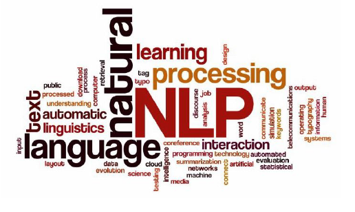
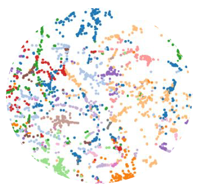

# Procesamiento de Lenguaje Natural 1
# Carrera de Especialización en Inteligencia Artificial
# Cohorte 17 2024
# Trabajo Final
# Florentino Arias (SIU a1719)
Este repositorio contiene los 4 desafíos planteados en las clases de la materia Procesamiento de Lenguaje Natural I de la Carrera de Especialización en Inteligencia Artificial de la FIUBA, correspondiente a la Cohorte N° 17/2024.
La presentación de este trabajo se realiza en el mes de abril de 2025.

## Desafíos y contenidos trabajados:

* D1_PLN_2025_AriasF_17Coh.ipynb: Vectorizador de documentos y modelos de clasificación sencillos.

* D2_PLN_2025_AriasF_17Coh.ipynb: Entrenamiento de embeddings con Gensim y búsqueda de términos similares y analogías.

* D3_PLN_2025_AriasF_17Coh.ipynb: Modelos de lenguaje y generación de secuencias.

* D4_PLN_2025_AriasF_17Coh.ipynb: QA Bot con seq2seq.

